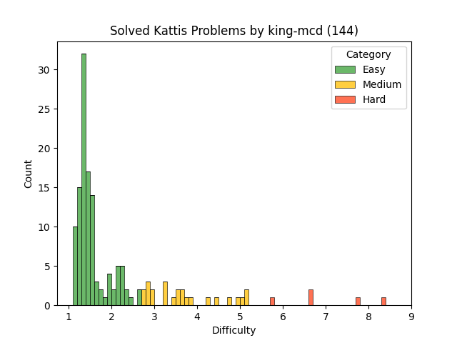

# King-McD Kattis Problems

These are problems I have solved on [Kattis](https://open.kattis.com)
while preparing for competitive programming competitions.

### Problem Difficulty

<table>
<thead>
<td>Name</td>
<td>Difficulty</td>
<td>Link</td>
</thead>
<tbody>

<tr>
<td>Til hamingju</td>
<td>1.0</td>
<td>https://open.kattis.com/problems/tilhamingju</td>
</tr>

<tr>
<td>Velkomin!</td>
<td>1.0</td>
<td>https://open.kattis.com/problems/velkomin</td>
</tr>

<tr>
<td>Á leið í bíó</td>
<td>1.1</td>
<td>https://open.kattis.com/problems/aleidibio</td>
</tr>

<tr>
<td>Draga Frá</td>
<td>1.1</td>
<td>https://open.kattis.com/problems/dragafra</td>
</tr>

<tr>
<td>Flatbökuveisla</td>
<td>1.1</td>
<td>https://open.kattis.com/problems/flatbokuveisla</td>
</tr>

<tr>
<td>Hello World!</td>
<td>1.1</td>
<td>https://open.kattis.com/problems/hello</td>
</tr>

<tr>
<td>Hipp Hipp</td>
<td>1.1</td>
<td>https://open.kattis.com/problems/hipphipp</td>
</tr>

<tr>
<td>Jack-O'-Lantern Juxtaposition</td>
<td>1.1</td>
<td>https://open.kattis.com/problems/jackolanternjuxtaposition</td>
</tr>

<tr>
<td>Leggja saman</td>
<td>1.1</td>
<td>https://open.kattis.com/problems/leggjasaman</td>
</tr>

<tr>
<td>Lubbi Lærir</td>
<td>1.1</td>
<td>https://open.kattis.com/problems/lubbilaerir</td>
</tr>

<tr>
<td>Metronome</td>
<td>1.1</td>
<td>https://open.kattis.com/problems/metronome</td>
</tr>

<tr>
<td>Millifærsla</td>
<td>1.1</td>
<td>https://open.kattis.com/problems/millifaersla</td>
</tr>

<tr>
<td>Óvissa</td>
<td>1.1</td>
<td>https://open.kattis.com/problems/ovissa</td>
</tr>

<tr>
<td>Reduplication</td>
<td>1.1</td>
<td>https://open.kattis.com/problems/reduplikation</td>
</tr>

<tr>
<td>A Shortcut to What?</td>
<td>1.1</td>
<td>https://open.kattis.com/problems/shortcuttowhat</td>
</tr>

<tr>
<td>Telja</td>
<td>1.1</td>
<td>https://open.kattis.com/problems/telja</td>
</tr>

<tr>
<td>Tölvunarfræðingar telja</td>
<td>1.1</td>
<td>https://open.kattis.com/problems/tolvunarfraedingartelja</td>
</tr>

<tr>
<td>Viðsnúningur</td>
<td>1.1</td>
<td>https://open.kattis.com/problems/vidsnuningur</td>
</tr>

<tr>
<td>Adding Trouble</td>
<td>1.2</td>
<td>https://open.kattis.com/problems/addingtrouble</td>
</tr>

<tr>
<td>Add Two Numbers</td>
<td>1.2</td>
<td>https://open.kattis.com/problems/addtwonumbers</td>
</tr>

<tr>
<td>Amerískur vinnustaður</td>
<td>1.2</td>
<td>https://open.kattis.com/problems/ameriskur</td>
</tr>

<tr>
<td>Besta gjöfin</td>
<td>1.2</td>
<td>https://open.kattis.com/problems/bestagjofin</td>
</tr>

<tr>
<td>Bijele</td>
<td>1.2</td>
<td>https://open.kattis.com/problems/bijele</td>
</tr>

<tr>
<td>Solving for Carrots</td>
<td>1.2</td>
<td>https://open.kattis.com/problems/carrots</td>
</tr>

<tr>
<td>Count the Vowels</td>
<td>1.2</td>
<td>https://open.kattis.com/problems/countthevowels</td>
</tr>

<tr>
<td>Decimal deletion</td>
<td>1.2</td>
<td>https://open.kattis.com/problems/decimaldeletion</td>
</tr>

<tr>
<td>Digit Swap</td>
<td>1.2</td>
<td>https://open.kattis.com/problems/digitswap</td>
</tr>

<tr>
<td>Echo Echo Echo</td>
<td>1.2</td>
<td>https://open.kattis.com/problems/echoechoecho</td>
</tr>

<tr>
<td>Framtíðar FIFA</td>
<td>1.2</td>
<td>https://open.kattis.com/problems/fifa</td>
</tr>

<tr>
<td>Flatter Land</td>
<td>1.2</td>
<td>https://open.kattis.com/problems/flatterland</td>
</tr>

<tr>
<td>Hack-a-Holics</td>
<td>1.2</td>
<td>https://open.kattis.com/problems/hackaholics</td>
</tr>

<tr>
<td>Hipp Hipp Húrra</td>
<td>1.2</td>
<td>https://open.kattis.com/problems/hipphipphurra</td>
</tr>

<tr>
<td>Hissing Microphone</td>
<td>1.2</td>
<td>https://open.kattis.com/problems/hissingmicrophone</td>
</tr>

<tr>
<td>Hraðgreining</td>
<td>1.2</td>
<td>https://open.kattis.com/problems/hradgreining</td>
</tr>

<tr>
<td>Is Y a Vowel?</td>
<td>1.2</td>
<td>https://open.kattis.com/problems/isyavowel</td>
</tr>

<tr>
<td>Jumbo Javelin</td>
<td>1.2</td>
<td>https://open.kattis.com/problems/jumbojavelin</td>
</tr>

<tr>
<td>Last Factorial Digit</td>
<td>1.2</td>
<td>https://open.kattis.com/problems/lastfactorialdigit</td>
</tr>

<tr>
<td>N-sum</td>
<td>1.2</td>
<td>https://open.kattis.com/problems/nsum</td>
</tr>

<tr>
<td>Odd Echo</td>
<td>1.2</td>
<td>https://open.kattis.com/problems/oddecho</td>
</tr>

<tr>
<td>Pop Count</td>
<td>1.2</td>
<td>https://open.kattis.com/problems/popcount</td>
</tr>

<tr>
<td>Quality-Adjusted Life-Year</td>
<td>1.2</td>
<td>https://open.kattis.com/problems/qaly</td>
</tr>

<tr>
<td>Quadrant Selection</td>
<td>1.2</td>
<td>https://open.kattis.com/problems/quadrant</td>
</tr>

<tr>
<td>Sort Two Numbers</td>
<td>1.2</td>
<td>https://open.kattis.com/problems/sorttwonumbers</td>
</tr>

<tr>
<td>Stórafmæli</td>
<td>1.2</td>
<td>https://open.kattis.com/problems/storafmaeli</td>
</tr>

<tr>
<td>Takkar</td>
<td>1.2</td>
<td>https://open.kattis.com/problems/takkar</td>
</tr>

<tr>
<td>Takk fyrir mig</td>
<td>1.2</td>
<td>https://open.kattis.com/problems/takkfyrirmig</td>
</tr>

<tr>
<td>Stuck In A Time Loop</td>
<td>1.2</td>
<td>https://open.kattis.com/problems/timeloop</td>
</tr>

<tr>
<td>Triangle Area</td>
<td>1.2</td>
<td>https://open.kattis.com/problems/triarea</td>
</tr>

<tr>
<td>Take Two Stones</td>
<td>1.2</td>
<td>https://open.kattis.com/problems/twostones</td>
</tr>

<tr>
<td>Two-sum</td>
<td>1.2</td>
<td>https://open.kattis.com/problems/twosum</td>
</tr>

<tr>
<td>Which is Greater?</td>
<td>1.2</td>
<td>https://open.kattis.com/problems/whichisgreater</td>
</tr>

<tr>
<td>Above Sea Level</td>
<td>1.3</td>
<td>https://open.kattis.com/problems/abovesealevel</td>
</tr>

<tr>
<td>Apaxiaaaaaaaaaaaans!</td>
<td>1.3</td>
<td>https://open.kattis.com/problems/apaxiaaans</td>
</tr>

<tr>
<td>Autori</td>
<td>1.3</td>
<td>https://open.kattis.com/problems/autori</td>
</tr>

<tr>
<td>Barcelona</td>
<td>1.3</td>
<td>https://open.kattis.com/problems/barcelona</td>
</tr>

<tr>
<td>Batter Up</td>
<td>1.3</td>
<td>https://open.kattis.com/problems/batterup</td>
</tr>

<tr>
<td>Betting</td>
<td>1.3</td>
<td>https://open.kattis.com/problems/betting</td>
</tr>

<tr>
<td>Bitte ein Bit</td>
<td>1.3</td>
<td>https://open.kattis.com/problems/bitteeinbit</td>
</tr>

<tr>
<td>Call for Problems</td>
<td>1.3</td>
<td>https://open.kattis.com/problems/callforproblems</td>
</tr>

<tr>
<td>Chanukah Challenge</td>
<td>1.3</td>
<td>https://open.kattis.com/problems/chanukah</td>
</tr>

<tr>
<td>Cold-puter Science</td>
<td>1.3</td>
<td>https://open.kattis.com/problems/cold</td>
</tr>

<tr>
<td>Cosmic Path Optimization</td>
<td>1.3</td>
<td>https://open.kattis.com/problems/cosmicpathoptimization</td>
</tr>

<tr>
<td>Finding An A</td>
<td>1.3</td>
<td>https://open.kattis.com/problems/findingana</td>
</tr>

<tr>
<td>FizzBuzz</td>
<td>1.3</td>
<td>https://open.kattis.com/problems/fizzbuzz</td>
</tr>

<tr>
<td>Fjöldi Bókstafa</td>
<td>1.3</td>
<td>https://open.kattis.com/problems/fjoldibokstafa</td>
</tr>

<tr>
<td>FYI</td>
<td>1.3</td>
<td>https://open.kattis.com/problems/fyi</td>
</tr>

<tr>
<td>Grass Seed Inc.</td>
<td>1.3</td>
<td>https://open.kattis.com/problems/grassseed</td>
</tr>

<tr>
<td>IsItHalloween.com</td>
<td>1.3</td>
<td>https://open.kattis.com/problems/isithalloween</td>
</tr>

<tr>
<td>Kiki Boba</td>
<td>1.3</td>
<td>https://open.kattis.com/problems/kikiboba</td>
</tr>

<tr>
<td>Knight Packing</td>
<td>1.3</td>
<td>https://open.kattis.com/problems/knightpacking</td>
</tr>

<tr>
<td>Leyniþjónusta</td>
<td>1.3</td>
<td>https://open.kattis.com/problems/leynithjonusta</td>
</tr>

<tr>
<td>Monopoly</td>
<td>1.3</td>
<td>https://open.kattis.com/problems/monopol</td>
</tr>

<tr>
<td>Öfugsnúið</td>
<td>1.3</td>
<td>https://open.kattis.com/problems/ofugsnuid</td>
</tr>

<tr>
<td>Pet</td>
<td>1.3</td>
<td>https://open.kattis.com/problems/pet</td>
</tr>

<tr>
<td>R2</td>
<td>1.3</td>
<td>https://open.kattis.com/problems/r2</td>
</tr>

<tr>
<td>Rating Problems</td>
<td>1.3</td>
<td>https://open.kattis.com/problems/ratingproblems</td>
</tr>

<tr>
<td>Shandy</td>
<td>1.3</td>
<td>https://open.kattis.com/problems/shandy</td>
</tr>

<tr>
<td>Spritt</td>
<td>1.3</td>
<td>https://open.kattis.com/problems/spritt</td>
</tr>

<tr>
<td>Aaah!</td>
<td>1.4</td>
<td>https://open.kattis.com/problems/aaah</td>
</tr>

<tr>
<td>Airfare Grants</td>
<td>1.4</td>
<td>https://open.kattis.com/problems/airfaregrants</td>
</tr>

<tr>
<td>Avion</td>
<td>1.4</td>
<td>https://open.kattis.com/problems/avion</td>
</tr>

<tr>
<td>Basketball One-on-One</td>
<td>1.4</td>
<td>https://open.kattis.com/problems/basketballoneonone</td>
</tr>

<tr>
<td>Bela</td>
<td>1.4</td>
<td>https://open.kattis.com/problems/bela</td>
</tr>

<tr>
<td>Call for Problems, Round 2</td>
<td>1.4</td>
<td>https://open.kattis.com/problems/callforproblemsround2</td>
</tr>

<tr>
<td>Cetvrta</td>
<td>1.4</td>
<td>https://open.kattis.com/problems/cetvrta</td>
</tr>

<tr>
<td>Class Field Trip</td>
<td>1.4</td>
<td>https://open.kattis.com/problems/classfieldtrip</td>
</tr>

<tr>
<td>Electrical Outlets</td>
<td>1.4</td>
<td>https://open.kattis.com/problems/electricaloutlets</td>
</tr>

<tr>
<td>Faktor</td>
<td>1.4</td>
<td>https://open.kattis.com/problems/faktor</td>
</tr>

<tr>
<td>Filip</td>
<td>1.4</td>
<td>https://open.kattis.com/problems/filip</td>
</tr>

<tr>
<td>GCD</td>
<td>1.4</td>
<td>https://open.kattis.com/problems/gcd</td>
</tr>

<tr>
<td>Greetings!</td>
<td>1.4</td>
<td>https://open.kattis.com/problems/greetings2</td>
</tr>

<tr>
<td>Keys, Phone, Wallet</td>
<td>1.4</td>
<td>https://open.kattis.com/problems/keysphonewallet</td>
</tr>

<tr>
<td>Magic Trick</td>
<td>1.4</td>
<td>https://open.kattis.com/problems/magictrick</td>
</tr>

<tr>
<td>Oddities</td>
<td>1.4</td>
<td>https://open.kattis.com/problems/oddities</td>
</tr>

<tr>
<td>Piece of Cake!</td>
<td>1.4</td>
<td>https://open.kattis.com/problems/pieceofcake2</td>
</tr>

<tr>
<td>Poker Hand</td>
<td>1.4</td>
<td>https://open.kattis.com/problems/pokerhand</td>
</tr>

<tr>
<td>Pot</td>
<td>1.4</td>
<td>https://open.kattis.com/problems/pot</td>
</tr>

<tr>
<td>Rectangle Area</td>
<td>1.4</td>
<td>https://open.kattis.com/problems/rectanglearea</td>
</tr>

<tr>
<td>Reversed Binary Numbers</td>
<td>1.4</td>
<td>https://open.kattis.com/problems/reversebinary</td>
</tr>

<tr>
<td>Simon Says</td>
<td>1.4</td>
<td>https://open.kattis.com/problems/simonsays</td>
</tr>

<tr>
<td>Spavanac</td>
<td>1.4</td>
<td>https://open.kattis.com/problems/spavanac</td>
</tr>

<tr>
<td>Stopwatch</td>
<td>1.4</td>
<td>https://open.kattis.com/problems/stopwatch</td>
</tr>

<tr>
<td>Sum Kind of Problem</td>
<td>1.4</td>
<td>https://open.kattis.com/problems/sumkindofproblem</td>
</tr>

<tr>
<td>Sum Squared Digits Function</td>
<td>1.4</td>
<td>https://open.kattis.com/problems/sumsquareddigits</td>
</tr>

<tr>
<td>Tarifa</td>
<td>1.4</td>
<td>https://open.kattis.com/problems/tarifa</td>
</tr>

<tr>
<td>Trik</td>
<td>1.4</td>
<td>https://open.kattis.com/problems/trik</td>
</tr>

<tr>
<td>Weak Vertices</td>
<td>1.4</td>
<td>https://open.kattis.com/problems/weakvertices</td>
</tr>

<tr>
<td>Zamka</td>
<td>1.4</td>
<td>https://open.kattis.com/problems/zamka</td>
</tr>

<tr>
<td>CPR Number</td>
<td>1.5</td>
<td>https://open.kattis.com/problems/cprnummer</td>
</tr>

<tr>
<td>Detailed Differences</td>
<td>1.5</td>
<td>https://open.kattis.com/problems/detaileddifferences</td>
</tr>

<tr>
<td>Dice Cup</td>
<td>1.5</td>
<td>https://open.kattis.com/problems/dicecup</td>
</tr>

<tr>
<td>Double Password</td>
<td>1.5</td>
<td>https://open.kattis.com/problems/doublepassword</td>
</tr>

<tr>
<td>Ekki dauði opna inni</td>
<td>1.5</td>
<td>https://open.kattis.com/problems/ekkidaudi</td>
</tr>

<tr>
<td>I've Been Everywhere, Man</td>
<td>1.5</td>
<td>https://open.kattis.com/problems/everywhere</td>
</tr>

<tr>
<td>Eye of Sauron</td>
<td>1.5</td>
<td>https://open.kattis.com/problems/eyeofsauron</td>
</tr>

<tr>
<td>Guess Who</td>
<td>1.5</td>
<td>https://open.kattis.com/problems/guesswho</td>
</tr>

<tr>
<td>Heart Rate</td>
<td>1.5</td>
<td>https://open.kattis.com/problems/heartrate</td>
</tr>

<tr>
<td>Heimavinna</td>
<td>1.5</td>
<td>https://open.kattis.com/problems/heimavinna</td>
</tr>

<tr>
<td>Intuitive Elements</td>
<td>1.5</td>
<td>https://open.kattis.com/problems/intuitiveelements</td>
</tr>

<tr>
<td>Islands</td>
<td>1.5</td>
<td>https://open.kattis.com/problems/islands3</td>
</tr>

<tr>
<td>Modulo</td>
<td>1.5</td>
<td>https://open.kattis.com/problems/modulo</td>
</tr>

<tr>
<td>Mylla</td>
<td>1.5</td>
<td>https://open.kattis.com/problems/mylla2</td>
</tr>

<tr>
<td>Number Fun</td>
<td>1.5</td>
<td>https://open.kattis.com/problems/numberfun</td>
</tr>

<tr>
<td>Oooh I See</td>
<td>1.5</td>
<td>https://open.kattis.com/problems/ooohisee</td>
</tr>

<tr>
<td>Building Pyramids</td>
<td>1.5</td>
<td>https://open.kattis.com/problems/pyramids</td>
</tr>

<tr>
<td>Quick Brown Fox</td>
<td>1.5</td>
<td>https://open.kattis.com/problems/quickbrownfox</td>
</tr>

<tr>
<td>Relocation</td>
<td>1.5</td>
<td>https://open.kattis.com/problems/relocation</td>
</tr>

<tr>
<td>Seven Wonders</td>
<td>1.5</td>
<td>https://open.kattis.com/problems/sevenwonders</td>
</tr>

<tr>
<td>Digit Product</td>
<td>1.5</td>
<td>https://open.kattis.com/problems/sifferprodukt</td>
</tr>

<tr>
<td>Turn It Up!</td>
<td>1.5</td>
<td>https://open.kattis.com/problems/skruop</td>
</tr>

<tr>
<td>Title Cost</td>
<td>1.5</td>
<td>https://open.kattis.com/problems/titlecost</td>
</tr>

<tr>
<td>Transit Woes</td>
<td>1.5</td>
<td>https://open.kattis.com/problems/transitwoes</td>
</tr>

<tr>
<td>Triple Sevens</td>
<td>1.5</td>
<td>https://open.kattis.com/problems/triplesevens</td>
</tr>

<tr>
<td>Uppröðun</td>
<td>1.5</td>
<td>https://open.kattis.com/problems/upprodun</td>
</tr>

<tr>
<td>Veci</td>
<td>1.5</td>
<td>https://open.kattis.com/problems/veci</td>
</tr>

<tr>
<td>Akcija</td>
<td>1.6</td>
<td>https://open.kattis.com/problems/akcija</td>
</tr>

<tr>
<td>Champernowne Verification</td>
<td>1.6</td>
<td>https://open.kattis.com/problems/champernowneverification</td>
</tr>

<tr>
<td>Das Blinkenlights</td>
<td>1.6</td>
<td>https://open.kattis.com/problems/dasblinkenlights</td>
</tr>

<tr>
<td>Fading Wind</td>
<td>1.6</td>
<td>https://open.kattis.com/problems/fadingwind</td>
</tr>

<tr>
<td>Hangman</td>
<td>1.6</td>
<td>https://open.kattis.com/problems/hangman</td>
</tr>

<tr>
<td>The Amazing Human Cannonball</td>
<td>1.6</td>
<td>https://open.kattis.com/problems/humancannonball2</td>
</tr>

<tr>
<td>Kemija</td>
<td>1.6</td>
<td>https://open.kattis.com/problems/kemija08</td>
</tr>

<tr>
<td>Line Them Up</td>
<td>1.6</td>
<td>https://open.kattis.com/problems/lineup</td>
</tr>

<tr>
<td>Nasty Hacks</td>
<td>1.6</td>
<td>https://open.kattis.com/problems/nastyhacks</td>
</tr>

<tr>
<td>No Duplicates</td>
<td>1.6</td>
<td>https://open.kattis.com/problems/nodup</td>
</tr>

<tr>
<td>N-Puzzle</td>
<td>1.6</td>
<td>https://open.kattis.com/problems/npuzzle</td>
</tr>

<tr>
<td>Odd Gnome</td>
<td>1.6</td>
<td>https://open.kattis.com/problems/oddgnome</td>
</tr>

<tr>
<td>Plants vs Bad Guys</td>
<td>1.6</td>
<td>https://open.kattis.com/problems/pvbg</td>
</tr>

<tr>
<td>Run-Length Encoding, Run!</td>
<td>1.6</td>
<td>https://open.kattis.com/problems/runlengthencodingrun</td>
</tr>

<tr>
<td>Sauna</td>
<td>1.6</td>
<td>https://open.kattis.com/problems/sauna</td>
</tr>

<tr>
<td>Shattered Cake</td>
<td>1.6</td>
<td>https://open.kattis.com/problems/shatteredcake</td>
</tr>

<tr>
<td>SMIL</td>
<td>1.6</td>
<td>https://open.kattis.com/problems/smil</td>
</tr>

<tr>
<td>Superyatzy</td>
<td>1.6</td>
<td>https://open.kattis.com/problems/superyatzy</td>
</tr>

<tr>
<td>Training</td>
<td>1.6</td>
<td>https://open.kattis.com/problems/training</td>
</tr>

<tr>
<td>ABC</td>
<td>1.7</td>
<td>https://open.kattis.com/problems/abc</td>
</tr>

<tr>
<td>Radio Commercials</td>
<td>1.7</td>
<td>https://open.kattis.com/problems/commercials</td>
</tr>

<tr>
<td>Cryptographer's Conundrum</td>
<td>1.7</td>
<td>https://open.kattis.com/problems/conundrum</td>
</tr>

<tr>
<td>Endurvinnsla</td>
<td>1.7</td>
<td>https://open.kattis.com/problems/endurvinnsla</td>
</tr>

<tr>
<td>Hiding Places</td>
<td>1.7</td>
<td>https://open.kattis.com/problems/hidingplaces</td>
</tr>

<tr>
<td>Lines Per Hour</td>
<td>1.7</td>
<td>https://open.kattis.com/problems/linesperhour</td>
</tr>

<tr>
<td>This Ain't Your Grandpa's Checkerboard</td>
<td>1.7</td>
<td>https://open.kattis.com/problems/thisaintyourgrandpascheckerboard</td>
</tr>

<tr>
<td>Tower Construction</td>
<td>1.7</td>
<td>https://open.kattis.com/problems/tornbygge</td>
</tr>

<tr>
<td>Attendance</td>
<td>1.8</td>
<td>https://open.kattis.com/problems/attendance2</td>
</tr>

<tr>
<td>Delimiter Soup</td>
<td>1.8</td>
<td>https://open.kattis.com/problems/delimitersoup</td>
</tr>

<tr>
<td>Keywords</td>
<td>1.8</td>
<td>https://open.kattis.com/problems/keywords</td>
</tr>

<tr>
<td>Missing Numbers</td>
<td>1.8</td>
<td>https://open.kattis.com/problems/missingnumbers</td>
</tr>

<tr>
<td>Much Room for Mushrooms</td>
<td>1.8</td>
<td>https://open.kattis.com/problems/muchroomformushrooms</td>
</tr>

<tr>
<td>Music Your Way</td>
<td>1.8</td>
<td>https://open.kattis.com/problems/musicyourway</td>
</tr>

<tr>
<td>Parking</td>
<td>1.8</td>
<td>https://open.kattis.com/problems/parking</td>
</tr>

<tr>
<td>Photo Encoding</td>
<td>1.8</td>
<td>https://open.kattis.com/problems/photoencoding</td>
</tr>

<tr>
<td>Shopaholic</td>
<td>1.8</td>
<td>https://open.kattis.com/problems/shopaholic</td>
</tr>

<tr>
<td>Soylent</td>
<td>1.8</td>
<td>https://open.kattis.com/problems/soylent</td>
</tr>

<tr>
<td>Ten Player Bingo</td>
<td>1.8</td>
<td>https://open.kattis.com/problems/tenplayerbingo</td>
</tr>

<tr>
<td>The Grand Adventure</td>
<td>1.8</td>
<td>https://open.kattis.com/problems/thegrandadventure</td>
</tr>

<tr>
<td>Who wins?</td>
<td>1.8</td>
<td>https://open.kattis.com/problems/vemvinner</td>
</tr>

<tr>
<td>Beehives</td>
<td>1.9</td>
<td>https://open.kattis.com/problems/beehives</td>
</tr>

<tr>
<td>Coloring Socks</td>
<td>1.9</td>
<td>https://open.kattis.com/problems/color</td>
</tr>

<tr>
<td>Convex Polygon Area</td>
<td>1.9</td>
<td>https://open.kattis.com/problems/convexpolygonarea</td>
</tr>

<tr>
<td>Election Paradox</td>
<td>1.9</td>
<td>https://open.kattis.com/problems/electionparadox</td>
</tr>

<tr>
<td>Emag Eht Htiw Em Pleh</td>
<td>1.9</td>
<td>https://open.kattis.com/problems/empleh</td>
</tr>

<tr>
<td>Guest List</td>
<td>1.9</td>
<td>https://open.kattis.com/problems/gestalisti</td>
</tr>

<tr>
<td>The Gourmet</td>
<td>1.9</td>
<td>https://open.kattis.com/problems/gourmeten</td>
</tr>

<tr>
<td>Rice judge</td>
<td>1.9</td>
<td>https://open.kattis.com/problems/risdomare</td>
</tr>

<tr>
<td>Warehouse</td>
<td>1.9</td>
<td>https://open.kattis.com/problems/warehouse</td>
</tr>

<tr>
<td>Climbing Worm</td>
<td>2.0</td>
<td>https://open.kattis.com/problems/climbingworm</td>
</tr>

<tr>
<td>Eiginnöfn</td>
<td>2.0</td>
<td>https://open.kattis.com/problems/eiginnofn</td>
</tr>

<tr>
<td>Espresso!</td>
<td>2.0</td>
<td>https://open.kattis.com/problems/espresso</td>
</tr>

<tr>
<td>Exam</td>
<td>2.0</td>
<td>https://open.kattis.com/problems/exam</td>
</tr>

<tr>
<td>Grid</td>
<td>2.0</td>
<td>https://open.kattis.com/problems/grid</td>
</tr>

<tr>
<td>Happy Happy Prime Prime</td>
<td>2.0</td>
<td>https://open.kattis.com/problems/happyprime</td>
</tr>

<tr>
<td>Hittast</td>
<td>2.0</td>
<td>https://open.kattis.com/problems/hittast</td>
</tr>

<tr>
<td>Math Homework</td>
<td>2.0</td>
<td>https://open.kattis.com/problems/mathhomework</td>
</tr>

<tr>
<td>Metaprogramming</td>
<td>2.0</td>
<td>https://open.kattis.com/problems/metaprogramming</td>
</tr>

<tr>
<td>Rampant Growth</td>
<td>2.0</td>
<td>https://open.kattis.com/problems/rampantgrowth</td>
</tr>

<tr>
<td>Simon Says</td>
<td>2.0</td>
<td>https://open.kattis.com/problems/simon</td>
</tr>

<tr>
<td>Illuminated City</td>
<td>2.0</td>
<td>https://open.kattis.com/problems/stadiljus</td>
</tr>

<tr>
<td>Ultimate Binary Watch</td>
<td>2.0</td>
<td>https://open.kattis.com/problems/ultimatebinarywatch</td>
</tr>

<tr>
<td>Welcome to Code Jam (Easy)</td>
<td>2.0</td>
<td>https://open.kattis.com/problems/welcomeeasy</td>
</tr>

<tr>
<td>Anti-Palindrome</td>
<td>2.1</td>
<td>https://open.kattis.com/problems/antipalindrome</td>
</tr>

<tr>
<td>Cinema Crowds</td>
<td>2.1</td>
<td>https://open.kattis.com/problems/cinema</td>
</tr>

<tr>
<td>Color-Coded Messages</td>
<td>2.1</td>
<td>https://open.kattis.com/problems/colorcodedmessages</td>
</tr>

<tr>
<td>A Different Problem</td>
<td>2.1</td>
<td>https://open.kattis.com/problems/different</td>
</tr>

<tr>
<td>Early Winter</td>
<td>2.1</td>
<td>https://open.kattis.com/problems/earlywinter</td>
</tr>

<tr>
<td>Fend Off Titan</td>
<td>2.1</td>
<td>https://open.kattis.com/problems/fendofftitan</td>
</tr>

<tr>
<td>Guess the Number</td>
<td>2.1</td>
<td>https://open.kattis.com/problems/guess</td>
</tr>

<tr>
<td>I Can Guess the Data Structure!</td>
<td>2.1</td>
<td>https://open.kattis.com/problems/guessthedatastructure</td>
</tr>

<tr>
<td>Leiðangur</td>
<td>2.1</td>
<td>https://open.kattis.com/problems/leidangur</td>
</tr>

<tr>
<td>Nine Knights</td>
<td>2.1</td>
<td>https://open.kattis.com/problems/nineknights</td>
</tr>

<tr>
<td>Ordered Problem Set</td>
<td>2.1</td>
<td>https://open.kattis.com/problems/orderedproblemset</td>
</tr>

<tr>
<td>Pizzubestun</td>
<td>2.1</td>
<td>https://open.kattis.com/problems/pizzubestun</td>
</tr>

<tr>
<td>Messy lists</td>
<td>2.1</td>
<td>https://open.kattis.com/problems/stokigalistor</td>
</tr>

<tr>
<td>Thanos</td>
<td>2.1</td>
<td>https://open.kattis.com/problems/thanos</td>
</tr>

<tr>
<td>The Weight Of Words</td>
<td>2.1</td>
<td>https://open.kattis.com/problems/weightofwords</td>
</tr>

<tr>
<td>Army Strength (Easy)</td>
<td>2.2</td>
<td>https://open.kattis.com/problems/armystrengtheasy</td>
</tr>

<tr>
<td>A Stack of Gold</td>
<td>2.2</td>
<td>https://open.kattis.com/problems/astackofgold</td>
</tr>

<tr>
<td>Bið, endalaus bið</td>
<td>2.2</td>
<td>https://open.kattis.com/problems/bidendalausbid</td>
</tr>

<tr>
<td>Boss Battle</td>
<td>2.2</td>
<td>https://open.kattis.com/problems/bossbattle</td>
</tr>

<tr>
<td>Bus Numbers</td>
<td>2.2</td>
<td>https://open.kattis.com/problems/busnumbers</td>
</tr>

<tr>
<td>Don't Be Fake</td>
<td>2.2</td>
<td>https://open.kattis.com/problems/dontbefake</td>
</tr>

<tr>
<td>Election</td>
<td>2.2</td>
<td>https://open.kattis.com/problems/election2</td>
</tr>

<tr>
<td>Getting Gold</td>
<td>2.2</td>
<td>https://open.kattis.com/problems/gold</td>
</tr>

<tr>
<td>Hot Potato (Easier Version)</td>
<td>2.2</td>
<td>https://open.kattis.com/problems/hotpotatoeasy</td>
</tr>

<tr>
<td>The Dragon of Loowater</td>
<td>2.2</td>
<td>https://open.kattis.com/problems/loowater</td>
</tr>

<tr>
<td>Partial Transmission</td>
<td>2.2</td>
<td>https://open.kattis.com/problems/partialtransmission</td>
</tr>

<tr>
<td>Permutation Encryption</td>
<td>2.2</td>
<td>https://open.kattis.com/problems/permutationencryption</td>
</tr>

<tr>
<td>Saving Daylight</td>
<td>2.2</td>
<td>https://open.kattis.com/problems/savingdaylight</td>
</tr>

<tr>
<td>Graduation</td>
<td>2.2</td>
<td>https://open.kattis.com/problems/skolavslutningen</td>
</tr>

<tr>
<td>Speedrun</td>
<td>2.2</td>
<td>https://open.kattis.com/problems/speedrun</td>
</tr>

<tr>
<td>Tautology</td>
<td>2.2</td>
<td>https://open.kattis.com/problems/tautology</td>
</tr>

<tr>
<td>Töflur</td>
<td>2.2</td>
<td>https://open.kattis.com/problems/toflur</td>
</tr>

<tr>
<td>Water Journal</td>
<td>2.2</td>
<td>https://open.kattis.com/problems/waterjournal</td>
</tr>

<tr>
<td>3D Printed Statues</td>
<td>2.3</td>
<td>https://open.kattis.com/problems/3dprinter</td>
</tr>

<tr>
<td>Battle Simulation</td>
<td>2.3</td>
<td>https://open.kattis.com/problems/battlesimulation</td>
</tr>

<tr>
<td>Brýr</td>
<td>2.3</td>
<td>https://open.kattis.com/problems/bryr</td>
</tr>

<tr>
<td>Disc District</td>
<td>2.3</td>
<td>https://open.kattis.com/problems/discdistrict</td>
</tr>

<tr>
<td>Not Amused</td>
<td>2.3</td>
<td>https://open.kattis.com/problems/notamused</td>
</tr>

<tr>
<td>Reduced ID Numbers</td>
<td>2.3</td>
<td>https://open.kattis.com/problems/reducedidnumbers</td>
</tr>

<tr>
<td>Refrigerator Transport</td>
<td>2.3</td>
<td>https://open.kattis.com/problems/refrigerator</td>
</tr>

<tr>
<td>Sticky Situation</td>
<td>2.3</td>
<td>https://open.kattis.com/problems/stickysituation</td>
</tr>

<tr>
<td>Treasure Hunt</td>
<td>2.3</td>
<td>https://open.kattis.com/problems/treasurehunt</td>
</tr>

<tr>
<td>Watchdog</td>
<td>2.3</td>
<td>https://open.kattis.com/problems/watchdog</td>
</tr>

<tr>
<td>Zyxab</td>
<td>2.3</td>
<td>https://open.kattis.com/problems/zyxab</td>
</tr>

<tr>
<td>A Cappella Recording</td>
<td>2.4</td>
<td>https://open.kattis.com/problems/acappellarecording</td>
</tr>

<tr>
<td>Another Candies</td>
<td>2.4</td>
<td>https://open.kattis.com/problems/anothercandies</td>
</tr>

<tr>
<td>Bendilfærslur</td>
<td>2.4</td>
<td>https://open.kattis.com/problems/bendilfaerslur</td>
</tr>

<tr>
<td>Closest Sums</td>
<td>2.4</td>
<td>https://open.kattis.com/problems/closestsums</td>
</tr>

<tr>
<td>Fun House</td>
<td>2.4</td>
<td>https://open.kattis.com/problems/funhouse</td>
</tr>

<tr>
<td>Lektira</td>
<td>2.4</td>
<td>https://open.kattis.com/problems/lektira</td>
</tr>

<tr>
<td>Room Painting</td>
<td>2.4</td>
<td>https://open.kattis.com/problems/roompainting</td>
</tr>

<tr>
<td>Bing It On</td>
<td>2.5</td>
<td>https://open.kattis.com/problems/bing</td>
</tr>

<tr>
<td>Counting Stars</td>
<td>2.5</td>
<td>https://open.kattis.com/problems/countingstars</td>
</tr>

<tr>
<td>Friday the 13th</td>
<td>2.5</td>
<td>https://open.kattis.com/problems/friday</td>
</tr>

<tr>
<td>Garage Door Code</td>
<td>2.5</td>
<td>https://open.kattis.com/problems/garagedoorcode</td>
</tr>

<tr>
<td>Infinite Race</td>
<td>2.5</td>
<td>https://open.kattis.com/problems/infiniterace2</td>
</tr>

<tr>
<td>Keylogger</td>
<td>2.5</td>
<td>https://open.kattis.com/problems/keylogger</td>
</tr>

<tr>
<td>Liðaskipting 2</td>
<td>2.5</td>
<td>https://open.kattis.com/problems/lidaskipting2</td>
</tr>

<tr>
<td>Shopping List</td>
<td>2.5</td>
<td>https://open.kattis.com/problems/shoppinglist</td>
</tr>

<tr>
<td>Smallest Calculated Value</td>
<td>2.5</td>
<td>https://open.kattis.com/problems/smallestcalculatedvalue</td>
</tr>

<tr>
<td>99 Problems</td>
<td>2.6</td>
<td>https://open.kattis.com/problems/99problems</td>
</tr>

<tr>
<td>Bikes and Barricades</td>
<td>2.6</td>
<td>https://open.kattis.com/problems/bikesandbarricades</td>
</tr>

<tr>
<td>Brexit</td>
<td>2.6</td>
<td>https://open.kattis.com/problems/brexit</td>
</tr>

<tr>
<td>Curse the Darkness</td>
<td>2.6</td>
<td>https://open.kattis.com/problems/cursethedarkness</td>
</tr>

<tr>
<td>Diverse Contest</td>
<td>2.6</td>
<td>https://open.kattis.com/problems/diversecontest</td>
</tr>

<tr>
<td>Engineering English</td>
<td>2.6</td>
<td>https://open.kattis.com/problems/engineeringenglish</td>
</tr>

<tr>
<td>Kaleidoscopic Palindromes</td>
<td>2.6</td>
<td>https://open.kattis.com/problems/kaleidoscopicpalindromes</td>
</tr>

<tr>
<td>Light Up</td>
<td>2.6</td>
<td>https://open.kattis.com/problems/lightup</td>
</tr>

<tr>
<td>Bridging Signals</td>
<td>2.6</td>
<td>https://open.kattis.com/problems/signals</td>
</tr>

<tr>
<td>Ding Dong Ditch</td>
<td>2.7</td>
<td>https://open.kattis.com/problems/dingdongditch</td>
</tr>

<tr>
<td>Grazed Grains</td>
<td>2.7</td>
<td>https://open.kattis.com/problems/grazedgrains</td>
</tr>

<tr>
<td>Grid Magic</td>
<td>2.7</td>
<td>https://open.kattis.com/problems/gridmagic</td>
</tr>

<tr>
<td>Keyboardd</td>
<td>2.7</td>
<td>https://open.kattis.com/problems/keyboardd</td>
</tr>

<tr>
<td>I Hate The Number Nine</td>
<td>2.7</td>
<td>https://open.kattis.com/problems/nine</td>
</tr>

<tr>
<td>Numbers On a Tree</td>
<td>2.7</td>
<td>https://open.kattis.com/problems/numbertree</td>
</tr>

<tr>
<td>Planets</td>
<td>2.7</td>
<td>https://open.kattis.com/problems/planets2</td>
</tr>

<tr>
<td>Tight words</td>
<td>2.7</td>
<td>https://open.kattis.com/problems/tight</td>
</tr>

<tr>
<td>Vaccine Efficacy</td>
<td>2.7</td>
<td>https://open.kattis.com/problems/vaccineefficacy</td>
</tr>

<tr>
<td>1-D Frogger (Easy)</td>
<td>2.8</td>
<td>https://open.kattis.com/problems/1dfroggereasy</td>
</tr>

<tr>
<td>Babelfish</td>
<td>2.8</td>
<td>https://open.kattis.com/problems/babelfish</td>
</tr>

<tr>
<td>Big Truck</td>
<td>2.8</td>
<td>https://open.kattis.com/problems/bigtruck</td>
</tr>

<tr>
<td>Cantina of Babel</td>
<td>2.8</td>
<td>https://open.kattis.com/problems/cantinaofbabel</td>
</tr>

<tr>
<td>Problem Classification</td>
<td>2.8</td>
<td>https://open.kattis.com/problems/problemclassification</td>
</tr>

<tr>
<td>4 thought</td>
<td>2.9</td>
<td>https://open.kattis.com/problems/4thought</td>
</tr>

<tr>
<td>Air Conditioned Minions</td>
<td>2.9</td>
<td>https://open.kattis.com/problems/airconditioned</td>
</tr>

<tr>
<td>Alphabet</td>
<td>2.9</td>
<td>https://open.kattis.com/problems/alphabet</td>
</tr>

<tr>
<td>Postal Delivery</td>
<td>2.9</td>
<td>https://open.kattis.com/problems/delivery</td>
</tr>

<tr>
<td>Dishonest Lottery</td>
<td>2.9</td>
<td>https://open.kattis.com/problems/dishonestlottery</td>
</tr>

<tr>
<td>Running Race</td>
<td>2.9</td>
<td>https://open.kattis.com/problems/kaploeb</td>
</tr>

<tr>
<td>Neighborhood Watch</td>
<td>2.9</td>
<td>https://open.kattis.com/problems/neighborhoodwatch</td>
</tr>

<tr>
<td>Cracking The Safe</td>
<td>2.9</td>
<td>https://open.kattis.com/problems/safe</td>
</tr>

<tr>
<td>Swap to Sort</td>
<td>2.9</td>
<td>https://open.kattis.com/problems/swaptosort</td>
</tr>

<tr>
<td>Eight Queens</td>
<td>3.0</td>
<td>https://open.kattis.com/problems/8queens</td>
</tr>

<tr>
<td>The Bus Card</td>
<td>3.0</td>
<td>https://open.kattis.com/problems/busskortet</td>
</tr>

<tr>
<td>Candle Box</td>
<td>3.0</td>
<td>https://open.kattis.com/problems/candlebox</td>
</tr>

<tr>
<td>Háhýsi</td>
<td>3.0</td>
<td>https://open.kattis.com/problems/hahysi</td>
</tr>

<tr>
<td>Scrolling Sign</td>
<td>3.0</td>
<td>https://open.kattis.com/problems/scrollingsign</td>
</tr>

<tr>
<td>Walrus Weights</td>
<td>3.0</td>
<td>https://open.kattis.com/problems/walrusweights</td>
</tr>

<tr>
<td>The Stock Market</td>
<td>3.1</td>
<td>https://open.kattis.com/problems/borsen</td>
</tr>

<tr>
<td>Counting Days</td>
<td>3.1</td>
<td>https://open.kattis.com/problems/countingdays</td>
</tr>

<tr>
<td>Flowery Trails</td>
<td>3.1</td>
<td>https://open.kattis.com/problems/flowerytrails</td>
</tr>

<tr>
<td>Number Squistem</td>
<td>3.1</td>
<td>https://open.kattis.com/problems/numbersquistem</td>
</tr>

<tr>
<td>Piano Lessons</td>
<td>3.1</td>
<td>https://open.kattis.com/problems/pianolessons</td>
</tr>

<tr>
<td>Daydreaming Stockbroker</td>
<td>3.1</td>
<td>https://open.kattis.com/problems/stockbroker</td>
</tr>

<tr>
<td>Torn To Pieces</td>
<td>3.1</td>
<td>https://open.kattis.com/problems/torn2pieces</td>
</tr>

<tr>
<td>Where's My Waterfall?</td>
<td>3.1</td>
<td>https://open.kattis.com/problems/wheresmywaterfall</td>
</tr>

<tr>
<td>Dobra</td>
<td>3.2</td>
<td>https://open.kattis.com/problems/dobra</td>
</tr>

<tr>
<td>Fluortanten</td>
<td>3.2</td>
<td>https://open.kattis.com/problems/fluortanten</td>
</tr>

<tr>
<td>Game of Nines</td>
<td>3.2</td>
<td>https://open.kattis.com/problems/gameofnines</td>
</tr>

<tr>
<td>Inflation</td>
<td>3.2</td>
<td>https://open.kattis.com/problems/inflation2</td>
</tr>

<tr>
<td>Keyboards in Concert</td>
<td>3.2</td>
<td>https://open.kattis.com/problems/keyboardconcert</td>
</tr>

<tr>
<td>Longest Increasing Subsequence</td>
<td>3.2</td>
<td>https://open.kattis.com/problems/longincsubseq</td>
</tr>

<tr>
<td>Crashing Robots</td>
<td>3.3</td>
<td>https://open.kattis.com/problems/crashingrobots</td>
</tr>

<tr>
<td>Martian DNA</td>
<td>3.3</td>
<td>https://open.kattis.com/problems/martiandna</td>
</tr>

<tr>
<td>Umm Code</td>
<td>3.3</td>
<td>https://open.kattis.com/problems/ummcode</td>
</tr>

<tr>
<td>Board Wrapping</td>
<td>3.3</td>
<td>https://open.kattis.com/problems/wrapping</td>
</tr>

<tr>
<td>CD</td>
<td>3.4</td>
<td>https://open.kattis.com/problems/cd</td>
</tr>

<tr>
<td>Cu Chi Tunnels</td>
<td>3.4</td>
<td>https://open.kattis.com/problems/cuchitunnels</td>
</tr>

<tr>
<td>Elo</td>
<td>3.4</td>
<td>https://open.kattis.com/problems/elo</td>
</tr>

<tr>
<td>Knapsack</td>
<td>3.4</td>
<td>https://open.kattis.com/problems/knapsack</td>
</tr>

<tr>
<td>Open Source</td>
<td>3.4</td>
<td>https://open.kattis.com/problems/opensource</td>
</tr>

<tr>
<td>Pick up sticks</td>
<td>3.4</td>
<td>https://open.kattis.com/problems/pickupsticks</td>
</tr>

<tr>
<td>Rimski</td>
<td>3.4</td>
<td>https://open.kattis.com/problems/rimski</td>
</tr>

<tr>
<td>Union-Find</td>
<td>3.4</td>
<td>https://open.kattis.com/problems/unionfind</td>
</tr>

<tr>
<td>99 Problems</td>
<td>3.5</td>
<td>https://open.kattis.com/problems/99problems2</td>
</tr>

<tr>
<td>Alloys</td>
<td>3.5</td>
<td>https://open.kattis.com/problems/alloys</td>
</tr>

<tr>
<td>Bungee Builder</td>
<td>3.5</td>
<td>https://open.kattis.com/problems/bungeebuilder</td>
</tr>

<tr>
<td>Raid Teams</td>
<td>3.5</td>
<td>https://open.kattis.com/problems/raidteams</td>
</tr>

<tr>
<td>Safe Passage</td>
<td>3.5</td>
<td>https://open.kattis.com/problems/safepassage</td>
</tr>

<tr>
<td>Elementary Math</td>
<td>3.6</td>
<td>https://open.kattis.com/problems/elementarymath</td>
</tr>

<tr>
<td>Falling Mugs</td>
<td>3.6</td>
<td>https://open.kattis.com/problems/falling</td>
</tr>

<tr>
<td>Gears and Axles</td>
<td>3.6</td>
<td>https://open.kattis.com/problems/gearsandaxles</td>
</tr>

<tr>
<td>If Index</td>
<td>3.6</td>
<td>https://open.kattis.com/problems/ifindex</td>
</tr>

<tr>
<td>Palindromic Password</td>
<td>3.6</td>
<td>https://open.kattis.com/problems/palindromicpassword</td>
</tr>

<tr>
<td>Missing Number</td>
<td>3.7</td>
<td>https://open.kattis.com/problems/missingnumber</td>
</tr>

<tr>
<td>A Pivotal Question</td>
<td>3.8</td>
<td>https://open.kattis.com/problems/apivotalquestion</td>
</tr>

<tr>
<td>BizzFuzz</td>
<td>3.8</td>
<td>https://open.kattis.com/problems/bizzfuzz</td>
</tr>

<tr>
<td>Graduation Guarantee</td>
<td>3.8</td>
<td>https://open.kattis.com/problems/graduationguarantee</td>
</tr>

<tr>
<td>Restaurant Orders</td>
<td>3.8</td>
<td>https://open.kattis.com/problems/orders</td>
</tr>

<tr>
<td>I'm Thinking of a Number</td>
<td>3.8</td>
<td>https://open.kattis.com/problems/thinkingofanumber</td>
</tr>

<tr>
<td>Tree Shopping</td>
<td>3.8</td>
<td>https://open.kattis.com/problems/treeshopping</td>
</tr>

<tr>
<td>All Pairs Shortest Path</td>
<td>3.9</td>
<td>https://open.kattis.com/problems/allpairspath</td>
</tr>

<tr>
<td>Exact Change</td>
<td>3.9</td>
<td>https://open.kattis.com/problems/exactchange3</td>
</tr>

<tr>
<td>Longest Common Subsequence</td>
<td>3.9</td>
<td>https://open.kattis.com/problems/longestcommonsubsequence</td>
</tr>

<tr>
<td>On Average They're Purple</td>
<td>3.9</td>
<td>https://open.kattis.com/problems/onaveragetheyrepurple</td>
</tr>

<tr>
<td>Purple Rain</td>
<td>3.9</td>
<td>https://open.kattis.com/problems/purplerain</td>
</tr>

<tr>
<td>Texas Summers</td>
<td>3.9</td>
<td>https://open.kattis.com/problems/texassummers</td>
</tr>

<tr>
<td>Exchange Rates</td>
<td>4.0</td>
<td>https://open.kattis.com/problems/exchangerates</td>
</tr>

<tr>
<td>Fridge</td>
<td>4.0</td>
<td>https://open.kattis.com/problems/fridge</td>
</tr>

<tr>
<td>Robots on a Grid</td>
<td>4.0</td>
<td>https://open.kattis.com/problems/robotsonagrid</td>
</tr>

<tr>
<td>Rock Band</td>
<td>4.0</td>
<td>https://open.kattis.com/problems/rockband</td>
</tr>

<tr>
<td>Contest Advancement</td>
<td>4.1</td>
<td>https://open.kattis.com/problems/contestadvancement</td>
</tr>

<tr>
<td>Diverse Cookies</td>
<td>4.1</td>
<td>https://open.kattis.com/problems/diversecookies</td>
</tr>

<tr>
<td>Ellipse Eclipse</td>
<td>4.1</td>
<td>https://open.kattis.com/problems/ellipseeclipse</td>
</tr>

<tr>
<td>Aww Man</td>
<td>4.2</td>
<td>https://open.kattis.com/problems/awwman</td>
</tr>

<tr>
<td>Flip Five</td>
<td>4.2</td>
<td>https://open.kattis.com/problems/flipfive</td>
</tr>

<tr>
<td>Prime Sieve</td>
<td>4.2</td>
<td>https://open.kattis.com/problems/primesieve</td>
</tr>

<tr>
<td>Alehouse</td>
<td>4.3</td>
<td>https://open.kattis.com/problems/alehouse</td>
</tr>

<tr>
<td>Memories of Passport Stamps</td>
<td>4.3</td>
<td>https://open.kattis.com/problems/memoriesofpassportstamps</td>
</tr>

<tr>
<td>Vanishing Parentheses</td>
<td>4.3</td>
<td>https://open.kattis.com/problems/vanishingparentheses</td>
</tr>

<tr>
<td>Magnesium Supplementation</td>
<td>4.4</td>
<td>https://open.kattis.com/problems/magnesiumsupplementation</td>
</tr>

<tr>
<td>Terraces</td>
<td>4.4</td>
<td>https://open.kattis.com/problems/terraces</td>
</tr>

<tr>
<td>Bombardment</td>
<td>4.5</td>
<td>https://open.kattis.com/problems/bombardment</td>
</tr>

<tr>
<td>Sandwich Art</td>
<td>4.5</td>
<td>https://open.kattis.com/problems/sandwichart</td>
</tr>

<tr>
<td>Simple Arithmetic</td>
<td>4.5</td>
<td>https://open.kattis.com/problems/simplearithmetic</td>
</tr>

<tr>
<td>Zigzag</td>
<td>4.5</td>
<td>https://open.kattis.com/problems/zigzag2</td>
</tr>

<tr>
<td>Emoticons</td>
<td>4.6</td>
<td>https://open.kattis.com/problems/emoticons2</td>
</tr>

<tr>
<td>Letter Balloons</td>
<td>4.6</td>
<td>https://open.kattis.com/problems/letterballoons</td>
</tr>

<tr>
<td>Suffix Sorting</td>
<td>4.6</td>
<td>https://open.kattis.com/problems/suffixsorting</td>
</tr>

<tr>
<td>Grade Curving</td>
<td>4.7</td>
<td>https://open.kattis.com/problems/gradecurving</td>
</tr>

<tr>
<td>Everything Is A Nail</td>
<td>4.8</td>
<td>https://open.kattis.com/problems/everythingisanail</td>
</tr>

<tr>
<td>ICPC Team Generation</td>
<td>4.8</td>
<td>https://open.kattis.com/problems/icpcteamgeneration</td>
</tr>

<tr>
<td>Sleeping on the Train</td>
<td>4.8</td>
<td>https://open.kattis.com/problems/sleepingonthetrain</td>
</tr>

<tr>
<td>Big And</td>
<td>4.9</td>
<td>https://open.kattis.com/problems/bigand</td>
</tr>

<tr>
<td>Big Integers</td>
<td>4.9</td>
<td>https://open.kattis.com/problems/bigintegers</td>
</tr>

<tr>
<td>Menger Sponge</td>
<td>4.9</td>
<td>https://open.kattis.com/problems/mengersponge</td>
</tr>

<tr>
<td>Rhythm Flow</td>
<td>4.9</td>
<td>https://open.kattis.com/problems/rhythmflow</td>
</tr>

<tr>
<td>Digit Sum</td>
<td>4.9</td>
<td>https://open.kattis.com/problems/siffersumma</td>
</tr>

<tr>
<td>Coin Stacks</td>
<td>5.0</td>
<td>https://open.kattis.com/problems/coinstacks</td>
</tr>

<tr>
<td>Grid Game</td>
<td>5.0</td>
<td>https://open.kattis.com/problems/gridgame</td>
</tr>

<tr>
<td>Unique Dice</td>
<td>5.0</td>
<td>https://open.kattis.com/problems/uniquedice</td>
</tr>

<tr>
<td>Pearls</td>
<td>5.1</td>
<td>https://open.kattis.com/problems/pearls2</td>
</tr>

<tr>
<td>Subway</td>
<td>5.1</td>
<td>https://open.kattis.com/problems/subway2</td>
</tr>

<tr>
<td>Bachet's Game</td>
<td>5.2</td>
<td>https://open.kattis.com/problems/bachetsgame</td>
</tr>

<tr>
<td>Codforces</td>
<td>5.2</td>
<td>https://open.kattis.com/problems/kodkraft</td>
</tr>

<tr>
<td>Bike Parking</td>
<td>5.3</td>
<td>https://open.kattis.com/problems/bikeparking</td>
</tr>

<tr>
<td>Prince and Princess</td>
<td>5.3</td>
<td>https://open.kattis.com/problems/princeandprincess</td>
</tr>

<tr>
<td>Sequence Reduction</td>
<td>5.3</td>
<td>https://open.kattis.com/problems/sequencereduction</td>
</tr>

<tr>
<td>Brownian Bears</td>
<td>5.4</td>
<td>https://open.kattis.com/problems/brownianbears</td>
</tr>

<tr>
<td>Chocolate Chip Fabrication</td>
<td>5.4</td>
<td>https://open.kattis.com/problems/chocolatechipfabrication</td>
</tr>

<tr>
<td>Brexit Negotiations</td>
<td>5.5</td>
<td>https://open.kattis.com/problems/brexitnegotiations</td>
</tr>

<tr>
<td>Excellent Engineers</td>
<td>5.5</td>
<td>https://open.kattis.com/problems/excellentengineers</td>
</tr>

<tr>
<td>Greedy Increasing Subsequences</td>
<td>5.5</td>
<td>https://open.kattis.com/problems/greedyincreasingsubsequences</td>
</tr>

<tr>
<td>ABC String</td>
<td>5.6</td>
<td>https://open.kattis.com/problems/abcstring</td>
</tr>

<tr>
<td>Beast Bullies</td>
<td>5.6</td>
<td>https://open.kattis.com/problems/beastbullies</td>
</tr>

<tr>
<td>Frogger</td>
<td>5.6</td>
<td>https://open.kattis.com/problems/frogger</td>
</tr>

<tr>
<td>Lexicography</td>
<td>5.6</td>
<td>https://open.kattis.com/problems/lexicography</td>
</tr>

<tr>
<td>Non-Prime Factors</td>
<td>5.6</td>
<td>https://open.kattis.com/problems/nonprimefactors</td>
</tr>

<tr>
<td>Space Alignment</td>
<td>5.6</td>
<td>https://open.kattis.com/problems/spacealignment</td>
</tr>

<tr>
<td>Item Selection</td>
<td>5.7</td>
<td>https://open.kattis.com/problems/itemselection</td>
</tr>

<tr>
<td>Olympus Måns</td>
<td>5.7</td>
<td>https://open.kattis.com/problems/olympusmans</td>
</tr>

<tr>
<td>Retribution!</td>
<td>5.7</td>
<td>https://open.kattis.com/problems/retribution</td>
</tr>

<tr>
<td>Frequent Flier</td>
<td>5.8</td>
<td>https://open.kattis.com/problems/frequentflier</td>
</tr>

<tr>
<td>Pillow Stacking</td>
<td>5.8</td>
<td>https://open.kattis.com/problems/pillowstacking</td>
</tr>

<tr>
<td>Adjoin the Networks</td>
<td>5.9</td>
<td>https://open.kattis.com/problems/adjoin</td>
</tr>

<tr>
<td>Apparatus</td>
<td>5.9</td>
<td>https://open.kattis.com/problems/apparatus</td>
</tr>

<tr>
<td>Elevated Rails</td>
<td>5.9</td>
<td>https://open.kattis.com/problems/elevatedrails</td>
</tr>

<tr>
<td>Average Substring Value</td>
<td>6.0</td>
<td>https://open.kattis.com/problems/averagesubstringvalue</td>
</tr>

<tr>
<td>Backup Towers</td>
<td>6.0</td>
<td>https://open.kattis.com/problems/backuptowers</td>
</tr>

<tr>
<td>Buying Coke</td>
<td>6.0</td>
<td>https://open.kattis.com/problems/coke</td>
</tr>

<tr>
<td>Rocky Mountain</td>
<td>6.0</td>
<td>https://open.kattis.com/problems/rockymountain</td>
</tr>

<tr>
<td>Intercept</td>
<td>6.1</td>
<td>https://open.kattis.com/problems/intercept</td>
</tr>

<tr>
<td>Nested Dolls</td>
<td>6.1</td>
<td>https://open.kattis.com/problems/nesteddolls</td>
</tr>

<tr>
<td>Tree Hopping</td>
<td>6.1</td>
<td>https://open.kattis.com/problems/treehopping</td>
</tr>

<tr>
<td>The Trip</td>
<td>6.1</td>
<td>https://open.kattis.com/problems/trip</td>
</tr>

<tr>
<td>Product Divisors</td>
<td>6.2</td>
<td>https://open.kattis.com/problems/productdivisors</td>
</tr>

<tr>
<td>Arrested Development</td>
<td>6.3</td>
<td>https://open.kattis.com/problems/arresteddevelopment</td>
</tr>

<tr>
<td>Commemorative Race</td>
<td>6.3</td>
<td>https://open.kattis.com/problems/commemorativerace</td>
</tr>

<tr>
<td>Wooden Fence</td>
<td>6.3</td>
<td>https://open.kattis.com/problems/fence</td>
</tr>

<tr>
<td>Meeting Free Fridays</td>
<td>6.3</td>
<td>https://open.kattis.com/problems/meetingfreefridays</td>
</tr>

<tr>
<td>Palindromic Word Search</td>
<td>6.3</td>
<td>https://open.kattis.com/problems/palindromicwordsearch</td>
</tr>

<tr>
<td>Pianissimo</td>
<td>6.3</td>
<td>https://open.kattis.com/problems/pianissimo</td>
</tr>

<tr>
<td>(un)Fair Play</td>
<td>6.3</td>
<td>https://open.kattis.com/problems/unfairplay</td>
</tr>

<tr>
<td>Heaps from Trees</td>
<td>6.4</td>
<td>https://open.kattis.com/problems/heapstrees</td>
</tr>

<tr>
<td>GUID Generator</td>
<td>6.5</td>
<td>https://open.kattis.com/problems/guidgenerator</td>
</tr>

<tr>
<td>Intergalactic Team</td>
<td>6.5</td>
<td>https://open.kattis.com/problems/intergalacticteam</td>
</tr>

<tr>
<td>Missing Number</td>
<td>6.5</td>
<td>https://open.kattis.com/problems/missingnumber2</td>
</tr>

<tr>
<td>Battleship</td>
<td>6.6</td>
<td>https://open.kattis.com/problems/battleship</td>
</tr>

<tr>
<td>Auto-Coin-o-Matic</td>
<td>6.7</td>
<td>https://open.kattis.com/problems/autocoinomatic</td>
</tr>

<tr>
<td>Sum and Product</td>
<td>6.7</td>
<td>https://open.kattis.com/problems/sumandproduct</td>
</tr>

<tr>
<td>On-Call Team</td>
<td>6.8</td>
<td>https://open.kattis.com/problems/oncallteam</td>
</tr>

<tr>
<td>Room Evacuation</td>
<td>6.8</td>
<td>https://open.kattis.com/problems/roomevacuation</td>
</tr>

<tr>
<td>Blind Bottles</td>
<td>6.9</td>
<td>https://open.kattis.com/problems/blindbottles</td>
</tr>

<tr>
<td>Balanced Tree Path</td>
<td>7.0</td>
<td>https://open.kattis.com/problems/balancedtreepath</td>
</tr>

<tr>
<td>Ticket Draw</td>
<td>7.1</td>
<td>https://open.kattis.com/problems/tickets</td>
</tr>

<tr>
<td>Alchemy</td>
<td>7.5</td>
<td>https://open.kattis.com/problems/alchemy2</td>
</tr>

<tr>
<td>Airport Coffee</td>
<td>7.8</td>
<td>https://open.kattis.com/problems/airportcoffee</td>
</tr>
