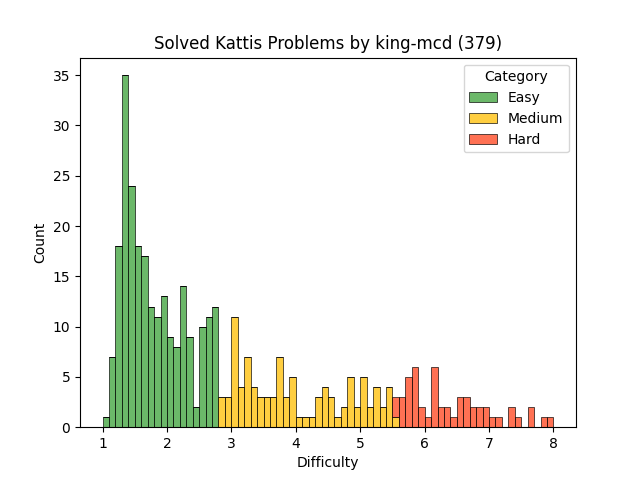

# King-McD Kattis Problems

These are problems I have solved on [Kattis](https://open.kattis.com)
while preparing for competitive programming competitions.

### Problem Difficulty

<table>
<thead>
<td>Name</td>
<td>Difficulty</td>
<td>Link</td>
</thead>
<tbody>

<tr>
<td>99 Problems</td>
<td>2.8</td>
<td>https://open.kattis.com/problems/99problems</td>
</tr>

<tr>
<td>A Different Problem</td>
<td>2.7</td>
<td>https://open.kattis.com/problems/different</td>
</tr>

<tr>
<td>Add Two Numbers</td>
<td>1.3</td>
<td>https://open.kattis.com/problems/addtwonumbers</td>
</tr>

<tr>
<td>Adding Trouble</td>
<td>1.3</td>
<td>https://open.kattis.com/problems/addingtrouble</td>
</tr>

<tr>
<td>Almost Sorted</td>
<td>8.4</td>
<td>https://open.kattis.com/problems/almostsorted2</td>
</tr>

<tr>
<td>Amerískur vinnustaður</td>
<td>1.3</td>
<td>https://open.kattis.com/problems/ameriskur</td>
</tr>

<tr>
<td>Apaxiaaaaaaaaaaaans!</td>
<td>1.4</td>
<td>https://open.kattis.com/problems/apaxiaaans</td>
</tr>

<tr>
<td>Arrangement</td>
<td>1.6</td>
<td>https://open.kattis.com/problems/upprodun</td>
</tr>

<tr>
<td>Autori</td>
<td>1.3</td>
<td>https://open.kattis.com/problems/autori</td>
</tr>

<tr>
<td>Basketball One-on-One</td>
<td>1.5</td>
<td>https://open.kattis.com/problems/basketballoneonone</td>
</tr>

<tr>
<td>Batter Up</td>
<td>1.4</td>
<td>https://open.kattis.com/problems/batterup</td>
</tr>

<tr>
<td>Bela</td>
<td>1.4</td>
<td>https://open.kattis.com/problems/bela</td>
</tr>

<tr>
<td>Betting</td>
<td>1.3</td>
<td>https://open.kattis.com/problems/betting</td>
</tr>

<tr>
<td>Bijele</td>
<td>1.4</td>
<td>https://open.kattis.com/problems/bijele</td>
</tr>

<tr>
<td>BizzFuzz</td>
<td>4.4</td>
<td>https://open.kattis.com/problems/bizzfuzz</td>
</tr>

<tr>
<td>Boss Battle</td>
<td>1.8</td>
<td>https://open.kattis.com/problems/bossbattle</td>
</tr>

<tr>
<td>Building Pyramids</td>
<td>1.6</td>
<td>https://open.kattis.com/problems/pyramids</td>
</tr>

<tr>
<td>Cetvrta</td>
<td>1.5</td>
<td>https://open.kattis.com/problems/cetvrta</td>
</tr>

<tr>
<td>Chanukah Challenge</td>
<td>1.4</td>
<td>https://open.kattis.com/problems/chanukah</td>
</tr>

<tr>
<td>Coin Stacks</td>
<td>3.8</td>
<td>https://open.kattis.com/problems/coinstacks</td>
</tr>

<tr>
<td>Cold-puter Science</td>
<td>1.3</td>
<td>https://open.kattis.com/problems/cold</td>
</tr>

<tr>
<td>Count the Vowels</td>
<td>1.4</td>
<td>https://open.kattis.com/problems/countthevowels</td>
</tr>

<tr>
<td>Counting Days</td>
<td>2.6</td>
<td>https://open.kattis.com/problems/countingdays</td>
</tr>

<tr>
<td>Detailed Differences</td>
<td>1.4</td>
<td>https://open.kattis.com/problems/detaileddifferences</td>
</tr>

<tr>
<td>Digit Swap</td>
<td>1.3</td>
<td>https://open.kattis.com/problems/digitswap</td>
</tr>

<tr>
<td>Echo Echo Echo</td>
<td>1.3</td>
<td>https://open.kattis.com/problems/echoechoecho</td>
</tr>

<tr>
<td>Ekki dauði opna inni</td>
<td>1.5</td>
<td>https://open.kattis.com/problems/ekkidaudi</td>
</tr>

<tr>
<td>Engineering English</td>
<td>2.4</td>
<td>https://open.kattis.com/problems/engineeringenglish</td>
</tr>

<tr>
<td>Exam</td>
<td>2.1</td>
<td>https://open.kattis.com/problems/exam</td>
</tr>

<tr>
<td>FYI</td>
<td>1.3</td>
<td>https://open.kattis.com/problems/fyi</td>
</tr>

<tr>
<td>Faktor</td>
<td>1.4</td>
<td>https://open.kattis.com/problems/faktor</td>
</tr>

<tr>
<td>Finding An A</td>
<td>1.3</td>
<td>https://open.kattis.com/problems/findingana</td>
</tr>

<tr>
<td>FizzBuzz</td>
<td>1.4</td>
<td>https://open.kattis.com/problems/fizzbuzz</td>
</tr>

<tr>
<td>Fluortanten</td>
<td>3.0</td>
<td>https://open.kattis.com/problems/fluortanten</td>
</tr>

<tr>
<td>Framtíðar FIFA</td>
<td>1.3</td>
<td>https://open.kattis.com/problems/fifa</td>
</tr>

<tr>
<td>Friday the 13th</td>
<td>2.0</td>
<td>https://open.kattis.com/problems/friday</td>
</tr>

<tr>
<td>GCD</td>
<td>1.6</td>
<td>https://open.kattis.com/problems/gcd</td>
</tr>

<tr>
<td>Grass Seed Inc.</td>
<td>1.4</td>
<td>https://open.kattis.com/problems/grassseed</td>
</tr>

<tr>
<td>Greetings!</td>
<td>1.3</td>
<td>https://open.kattis.com/problems/greetings2</td>
</tr>

<tr>
<td>Hangman</td>
<td>1.7</td>
<td>https://open.kattis.com/problems/hangman</td>
</tr>

<tr>
<td>Heart Rate</td>
<td>1.4</td>
<td>https://open.kattis.com/problems/heartrate</td>
</tr>

<tr>
<td>Hello World!</td>
<td>1.1</td>
<td>https://open.kattis.com/problems/hello</td>
</tr>

<tr>
<td>Hissing Microphone</td>
<td>1.4</td>
<td>https://open.kattis.com/problems/hissingmicrophone</td>
</tr>

<tr>
<td>Homework</td>
<td>1.6</td>
<td>https://open.kattis.com/problems/heimavinna</td>
</tr>

<tr>
<td>Hraðgreining</td>
<td>1.3</td>
<td>https://open.kattis.com/problems/hradgreining</td>
</tr>

<tr>
<td>I've Been Everywhere, Man</td>
<td>1.4</td>
<td>https://open.kattis.com/problems/everywhere</td>
</tr>

<tr>
<td>Inflation</td>
<td>3.4</td>
<td>https://open.kattis.com/problems/inflation2</td>
</tr>

<tr>
<td>IsItHalloween.com</td>
<td>1.4</td>
<td>https://open.kattis.com/problems/isithalloween</td>
</tr>

<tr>
<td>Jack-O'-Lantern Juxtaposition</td>
<td>1.3</td>
<td>https://open.kattis.com/problems/jackolanternjuxtaposition</td>
</tr>

<tr>
<td>Jumbo Javelin</td>
<td>1.3</td>
<td>https://open.kattis.com/problems/jumbojavelin</td>
</tr>

<tr>
<td>Knight Packing</td>
<td>1.3</td>
<td>https://open.kattis.com/problems/knightpacking</td>
</tr>

<tr>
<td>Last Factorial Digit</td>
<td>1.4</td>
<td>https://open.kattis.com/problems/lastfactorialdigit</td>
</tr>

<tr>
<td>Leggja saman</td>
<td>1.3</td>
<td>https://open.kattis.com/problems/leggjasaman</td>
</tr>

<tr>
<td>Martian DNA</td>
<td>3.9</td>
<td>https://open.kattis.com/problems/martiandna</td>
</tr>

<tr>
<td>Messy lists</td>
<td>2.2</td>
<td>https://open.kattis.com/problems/stokigalistor</td>
</tr>

<tr>
<td>Metronome</td>
<td>1.2</td>
<td>https://open.kattis.com/problems/metronome</td>
</tr>

<tr>
<td>Missing Number</td>
<td>3.3</td>
<td>https://open.kattis.com/problems/missingnumber</td>
</tr>

<tr>
<td>Monopoly</td>
<td>1.5</td>
<td>https://open.kattis.com/problems/monopol</td>
</tr>

<tr>
<td>Nasty Hacks</td>
<td>1.4</td>
<td>https://open.kattis.com/problems/nastyhacks</td>
</tr>

<tr>
<td>No Duplicates</td>
<td>1.5</td>
<td>https://open.kattis.com/problems/nodup</td>
</tr>

<tr>
<td>Not Amused</td>
<td>2.8</td>
<td>https://open.kattis.com/problems/notamused</td>
</tr>

<tr>
<td>Odd Echo</td>
<td>1.4</td>
<td>https://open.kattis.com/problems/oddecho</td>
</tr>

<tr>
<td>Oddities</td>
<td>1.4</td>
<td>https://open.kattis.com/problems/oddities</td>
</tr>

<tr>
<td>Pet</td>
<td>1.5</td>
<td>https://open.kattis.com/problems/pet</td>
</tr>

<tr>
<td>Piece of Cake!</td>
<td>1.4</td>
<td>https://open.kattis.com/problems/pieceofcake2</td>
</tr>

<tr>
<td>Pizzubestun</td>
<td>2.3</td>
<td>https://open.kattis.com/problems/pizzubestun</td>
</tr>

<tr>
<td>Poker Hand</td>
<td>1.5</td>
<td>https://open.kattis.com/problems/pokerhand</td>
</tr>

<tr>
<td>Quadrant Selection</td>
<td>1.3</td>
<td>https://open.kattis.com/problems/quadrant</td>
</tr>

<tr>
<td>Quality-Adjusted Life-Year</td>
<td>1.3</td>
<td>https://open.kattis.com/problems/qaly</td>
</tr>

<tr>
<td>R2</td>
<td>1.4</td>
<td>https://open.kattis.com/problems/r2</td>
</tr>

<tr>
<td>Relocation</td>
<td>1.5</td>
<td>https://open.kattis.com/problems/relocation</td>
</tr>

<tr>
<td>Reverse</td>
<td>1.6</td>
<td>https://open.kattis.com/problems/ofugsnuid</td>
</tr>

<tr>
<td>Reversed Binary Numbers</td>
<td>1.5</td>
<td>https://open.kattis.com/problems/reversebinary</td>
</tr>

<tr>
<td>SMIL</td>
<td>1.6</td>
<td>https://open.kattis.com/problems/smil</td>
</tr>

<tr>
<td>Simple Arithmetic</td>
<td>4.2</td>
<td>https://open.kattis.com/problems/simplearithmetic</td>
</tr>

<tr>
<td>Solving for Carrots</td>
<td>1.4</td>
<td>https://open.kattis.com/problems/carrots</td>
</tr>

<tr>
<td>Sort Two Numbers</td>
<td>1.4</td>
<td>https://open.kattis.com/problems/sorttwonumbers</td>
</tr>

<tr>
<td>Spritt</td>
<td>1.4</td>
<td>https://open.kattis.com/problems/spritt</td>
</tr>

<tr>
<td>Stopwatch</td>
<td>1.6</td>
<td>https://open.kattis.com/problems/stopwatch</td>
</tr>

<tr>
<td>Stuck In A Time Loop</td>
<td>1.3</td>
<td>https://open.kattis.com/problems/timeloop</td>
</tr>

<tr>
<td>Sum Squared Digits Function</td>
<td>1.5</td>
<td>https://open.kattis.com/problems/sumsquareddigits</td>
</tr>

<tr>
<td>Take Two Stones</td>
<td>1.3</td>
<td>https://open.kattis.com/problems/twostones</td>
</tr>

<tr>
<td>Tarifa</td>
<td>1.3</td>
<td>https://open.kattis.com/problems/tarifa</td>
</tr>

<tr>
<td>Terraces</td>
<td>3.8</td>
<td>https://open.kattis.com/problems/terraces</td>
</tr>

<tr>
<td>The Bus Card</td>
<td>2.9</td>
<td>https://open.kattis.com/problems/busskortet</td>
</tr>

<tr>
<td>Ticket Draw</td>
<td>6.6</td>
<td>https://open.kattis.com/problems/tickets</td>
</tr>

<tr>
<td>Tower Construction</td>
<td>1.7</td>
<td>https://open.kattis.com/problems/tornbygge</td>
</tr>

<tr>
<td>Triangle Area</td>
<td>1.4</td>
<td>https://open.kattis.com/problems/triarea</td>
</tr>

<tr>
<td>Trik</td>
<td>1.4</td>
<td>https://open.kattis.com/problems/trik</td>
</tr>

<tr>
<td>Turn It Up!</td>
<td>1.6</td>
<td>https://open.kattis.com/problems/skruop</td>
</tr>

<tr>
<td>Velkomin!</td>
<td>1.1</td>
<td>https://open.kattis.com/problems/velkomin</td>
</tr>

<tr>
<td>Viðsnúningur</td>
<td>1.2</td>
<td>https://open.kattis.com/problems/vidsnuningur</td>
</tr>

<tr>
<td>Warehouse</td>
<td>2.2</td>
<td>https://open.kattis.com/problems/warehouse</td>
</tr>

<tr>
<td>Zamka</td>
<td>1.4</td>
<td>https://open.kattis.com/problems/zamka</td>
</tr>

<tr>
<td>Óvissa</td>
<td>1.2</td>
<td>https://open.kattis.com/problems/ovissa</td>
</tr>
